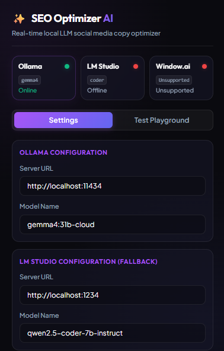

# SEO Social Optimizer AI

SEO Social Optimizer AI is a powerful Chrome extension that allows you to select text on social media sites and instantly optimize it for SEO in-place using local LLMs (Ollama, LM Studio) or Chrome's built-in on-device Gemini Nano (`window.ai`).

## Overview

Writing engaging, search-optimized social media posts can be time-consuming. This extension leverages local, private artificial intelligence to instantly rewrite selected text for Facebook, Instagram, LinkedIn, and X (Twitter) directly in the browser. It features a robust multi-provider local AI pipeline that prioritizes local AI servers and gracefully falls back to Chrome's built-in Gemini Nano.

---

## Features

- **Inline Floating Selection Badge**: Select text in any text input or editable field on supported social sites, and a premium "Optimize" badge will slide into view directly above your selection.
- **Smart In-Place Replacement**: Replaces selection directly using reactive framework events (supporting React/Vue/standard editors) or falls back to standard clipboard copying if the context is read-only.
- **Resilient Multi-Provider Fallback Pipeline**:
  1. **Ollama**: Default high-performance local inference endpoint.
  2. **LM Studio**: Secondary fallback local server.
  3. **Window.ai (Chrome Gemini Nano)**: Tertiary fallback using the browser's built-in language model.
- **Context-Separation Bridging**: Implements a secure dual-world message bridge (`content_bridge.js` in standard `ISOLATED` context communicating with `content_script.js` in `MAIN` context) to access `window.ai` without sacrificing security or extension stability.
- **Vibrant Dark-Themed UI**: Premium popup with connection status checks, dynamic settings configuration, and custom prompt testing playground.
- **Non-Intrusive Custom Toasts**: Beautiful native-styled in-page toast alerts notifying you about provider success or errors.

---

## Tech Stack

- **Core**: Vanilla HTML5, CSS3, JavaScript (ES6+)
- **Architecture**: Manifest V3 Chrome Extension
- **Local AI Engines**: Ollama API, LM Studio (OpenAI-compatible) API
- **On-Device AI**: Google Chrome Prompt/Language Model API (`window.ai`)

---

## Requirements

- **Google Chrome** (Latest Stable or Dev/Canary channel recommended)
- **Local AI Endpoint (Optional but Recommended)**:
  - **Ollama**: Running locally at `http://localhost:11434` with your preferred model downloaded (e.g. `gemma4:31b`, `llama3`, etc.).
  - **LM Studio**: Running local server at `http://localhost:1234` with compatible model loaded.
- **Chrome Gemini Nano (For Window.ai Fallback)**:
  - Enable `chrome://flags/#optimization-guide-on-device-model` -> Set to "BypassPrefRequirement" or "Enabled".
  - Enable `chrome://flags/#prompt-api-for-gemini-nano` -> Set to "Enabled".
  - Relaunch Chrome and wait for Chrome to download the model (check status in `chrome://components/` under "Optimization Guide On Device Model").

---

## Installation

1. **Download/Clone** this repository to your local machine.
2. Open Google Chrome and navigate to `chrome://extensions/`.
3. Toggle the **Developer mode** switch in the top right corner.
4. Click on **Load unpacked** in the top left.
5. Select the project root folder (`Chrome extension seo`) containing the `manifest.json`.
6. The SEO Social Optimizer AI icon will now appear in your extension toolbar.

---

## Configuration

Click on the extension icon in the toolbar to access the premium configuration dashboard:

1. **Settings Tab**:
   - **Ollama Configuration**: Customise your local endpoint URL and specify the exact model name.
   - **LM Studio Configuration**: Set the local OpenAI-compatible endpoint URL and active model.
   - **System Prompt**: Fine-tune the instructions given to the LLM (default instructs it to act as an SEO copywriter, preserve tone, and append 3-5 high-traffic hashtags).
   - Press **Save Settings** to persist the details to `chrome.storage.local`.
2. **Playground Tab**:
   - Directly test prompts and view raw optimization output in the popup before posting.
   - Copy results instantly with a single button click.
3. **Connection Status Cards**:
   - Real-time online/offline checks pinging Ollama, LM Studio, and Chrome's built-in AI status (Available/Unsupported/Not Downloaded) to keep you informed of your setup.
